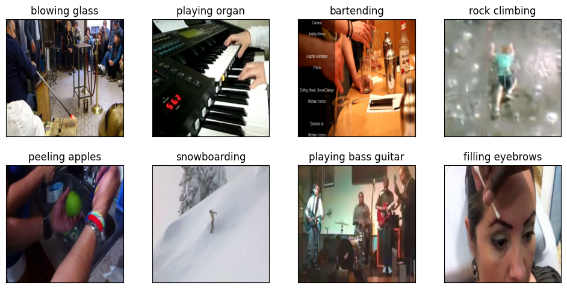

# Video Classification Training on K400-Tiny

This repository serves as an example training pipeline for ML projects. It implements the computer vision task of **video classification training** with `pytorch`, `torchvision` and `pytorchvideo`.

The following components are included:
- Data preparation and data splitting
- Video classification model [R(2+1)D-18](https://pytorch.org/vision/main/models/generated/torchvision.models.video.r2plus1d_18.html)
- Training and evaluation
- `mlflow` for experiment tracking and metric logging
- Options for distributed training with `torch.distributed`, `DistributedDataParallel`
- Options for exporting to standard format [ONNX](https://pytorch.org/docs/stable/onnx.html)

For demo purposes, we will be using a very tiny subselection of the [Kinetics-400](https://www.deepmind.com/open-source/kinetics) Dataset (K400) which we denote as **K400-Tiny**. The videos are already preprocessed into frames of 336x336.

Prerequisites are the tiny subset of the K400 images `example_data/k400tiny_images` and the `example_data/k400tiny_ground_truth.csv` file with the ground truth.

Some examples from the Kinetics-400 Dataset are shown below.

<p align="center">
    
</p>

## Setup

Poetry is used in this project. To install the version of poetry, do:

```bash
pip install -r requirements.txt
```

The `pyproject.toml` file contains the environment with the packages used in this project. To install these packages you can for instance use:

```bash
poetry install --without dev
```

### Data preparation

Go to the directory `util_scripts` and run the python script `make_datasplit.py` to prepare the data. For example:

```bash
cd util_scripts
python make_datasplit.py
```

Use the arguments `--gt_csv <PATH_TO_GT_CSV>` and `--root_dir <PATH_TO_IMAGE_DIR>` to give in different paths to the ground truth csv file and the image directory.

The above command will store some files in the directory `k400tiny`. The main file that we will use in training is `annotations.json`, containing annotations for the complete database (train/val/test). This file will give us all the information we need later on for use in our pytorch `Dataset`.

The split files `train.csv`, `val.csv` and `test.csv` are also stored for inspection.

## How to run

### Training (Single GPU)

We will assume that the `annotations.json` file is stored in the `k400tiny` folder and the images are in the `data/k400tiny_images` folder. Otherwise, use the argument `--annotation_path` to give in the correct path for the annotations and the `--data_path` to give the path for the images.

For training on a single GPU, use:

```bash
python run_training.py
```

### Distributed training

To set up distributed training on multiple GPUs or multiple nodes, please take a look at `run_distributed.py` and the arguments related to distributed training at the bottom. `run_distributed.py` sets up the distributed training based on these arguments `num_nodes` (total number of nodes), `num_gpus_node` (number of GPUs per node), `node_rank` (rank of the current node), etc.

#### Running on one node

If you want to run on one node with 4 GPUs, you have to use:

```bash
python run_distributed.py --num_nodes 1 --num_gpus_node 4 --node_rank 0 --hostname example-machine
```

#### Running on multiple nodes

For running 2 nodes with each 4 GPUs it will be along the following lines; one node needs to set this:

```bash
python run_distributed.py --num_nodes 2 --num_gpus_node 4 --node_rank 0 --hostname example-machine-1
```

and the other node uses this:
```bash
python run_distributed.py --num_nodes 2 --num_gpus_node 4 --node_rank 1 --hostname example-machine-2
```

### Validation

Run `--val_only` to run only the evaluation.

### Experiment logging

After running trainings, run `mlflow ui` in this folder to see logged parameters, metrics, best checkpoint and visualization images.

### Exporting to ONNX

At the end of training, the best model will automatically be exported to onnx format and saved locally.

Additionally, it is also possible to save onnx versions directly (e.g. without training). For example, to export a pretrained model, run the following:

```bash
python run_training.py --weights R2Plus1D_18_Weights.KINETICS400_V1 --export_only
```

To export a previously trained model, run the following:

```bash
python run_training.py --load_model <path_to_model_to_resume> --export_only
```

To export the best model stored locally, run:

```bash
python run_training.py --export_only`
```

## Implementation details

### Data Preparation and Data splitting

We chose to make a database with a split of 80%/10%/10%. The training set (80%) and the validation set (10%) are used in the training pipeline. The validation set is helpful to get an idea of the performance of the model, whether it is overfitting, and in order to tweak the model. The goal of the test set is to confirm results on a completely held out set. Currently, the test set is not being used in this pipeline, but it would be a relatively simple addition to add a separate test function on the test set.

Even though it would be better to move the files in the `images` directory into subdirectories such as `train`, `val`, `test` to lower the chance of ever using the wrong data, we chose not to move the files. The reason is that with Kinetics-400 we need to assume we will have hundreds of thousands of images in storage, and it might be a slow operation to move that many files (one might choose to do the moving operation at a later time, or to download data directly into split folders).

### Video classification Model

We use a [R(2+1)D-18](https://scontent-ams2-1.xx.fbcdn.net/v/t39.8562-6/240835828_1082929955846104_3750365702351306252_n.pdf?_nc_cat=106&ccb=1-7&_nc_sid=ad8a9d&_nc_ohc=5sVz7MO4ZaQAX91L8ei&_nc_ht=scontent-ams2-1.xx&oh=00_AfD0zNY9kvjsIvvN1AL52r9f_VElQsF3QGJz5xBtz4HohA&oe=6519BB17) video classification model. We chose this model because it is relatively small (18 layers) and will therefore be easier to run from our system, and because the R(2+1)D architecture improves on computational complexity over architectures like the vanilla ResNet-3D.

### Data preprocessing and Augmentations

As for data preprocessing, the Kinetics video clips have already been converted into jpg images by sampling with an unknown frame rate. Each folder provided contains 40 images.

We resize to a short side of 128 and take a center crop to arrive at a spatial resolution of 112 x 112. This can be adjusted by using `resize_size` and the `crop_size` arguments. We use clips of 16 frames as input uniformly sampled from the videos. The length of the video clips can be controlled by `clip_len` argument. For normalization we use the mean and the std mentioned [here](https://pytorch.org/vision/stable/models/generated/torchvision.models.video.r2plus1d_18.html#torchvision.models.video.r2plus1d_18) in reference to the Kinetics-400 dataset.

### Arguments

For configuration of hyperparameters and other settings, `argparse` is used. Another option would be to use a config file to store settings, for example a yaml file. This is often convenient to quickly test and share settings. However, one would have to manually add type checks to the code to handle unexpected input. We have used argparse here because argparse provides out of the box type checking on arguments.

See below for the help section of the arguments (`python run_training.py --help`).

```bash
Video Classification Training on K400-Tiny

options:
  -h, --help            show this help message and exit
  --name NAME           name of experiment
  --version VERSION     version of experiment
  --description DESCRIPTION
                        description of experiment
  --print_interval PRINT_INTERVAL
                        Number of iterations to print information
  --data_path DATA_PATH
                        path to image directory
  --annotation_path ANNOTATION_PATH
                        dataset path
  --num_classes {400}   Number of classes for the dataset
  --clip_len CLIP_LEN   Number of frames per clip
  --resize_size RESIZE_SIZE
                        the min resize size used for train and validation
  --crop_size CROP_SIZE
                        the min crop size used in training and validation
  --batch_size BATCH_SIZE
                        Amount of samples per GPU
  --num_workers NUM_WORKERS
                        number of data loading workers
  --num_epochs NUM_EPOCHS
                        number of total epochs
  --lr LR               Learning rate
  --momentum MOMENTUM   Momentum
  --weight_decay WEIGHT_DECAY
                        weight decay (default: 1e-4)
  --save_every SAVE_EVERY
                        frequency to save the model to local checkpoint dir
  --local_checkpoint_dir LOCAL_CHECKPOINT_DIR
                        path to save checkpoints locally
  --onnx_export_dir ONNX_EXPORT_DIR
                        path to save ONNX export for deployment
  --resume              Load model with weights
  --no-resume           Load model with weights
  --load_model LOAD_MODEL
                        path of checkpoint to load when resume is True
  --val_only            Only run the validation
  --no-val_only         Only run the validation
  --export_only         Only export to onnx, either best locally stored or given load_model
  --no-export_only      Only export to onnx, either best locally stored or given load_model
  --weights WEIGHTS     the torchvision pretrained weights name to load, e.g.R2Plus1D_18_Weights.KINETICS400_V1
```

## Explanation of design choices

### Project structure

We have put our dataset code into a folder `datasets` and our data augmentation code into a folder `transforms`. Though not strictly needed as we only have one main dataset and one main transform, it does reduce the amount of files and therefore the clutter in the root of the project a bit. With a larger growing project, it might be desirable to also put models into a folder called `models`, utils into `utils`, etcetera.

### Possible improvements and additional thoughts

- Add a testing step on the test dataset.
- More data augmentation (both spatial and temporal) could help with generalization, which is especially important in industry applications. For example, spatial augmentation like color jittering or gaussian blur as spatial augmentations. For the temporal dimension, taking clips from random timestamps (currently we are uniformly sampling).
- It could be beneficial to try a different optimizer than vanilla SGD or SGD with momentum, for example *Adam*. In addition to having an option to use momentum like in SGD, Adam also has an adaptable learning rate.
- Another enhancement would be to add a learning rate scheduler, such as Step Decay or Exponential decay. Lately it has been shown that learning rate schedulers with warmup or cosine annealing can also be helpful.
- Aside form using weight regularization, dropout could also be used or increased to tackle overfitting issues.
- Sync batch norm is also often used in combination with distributed training. *Batch norm* is a layer often used before non-linear layers; it normalizes with batch statistics and rescales by learned hyperparameters gamma and beta, which helps to stabilize and speed up training. *Sync batch norm* is a method to not only have batch norm on a single GPU but to apply batch norm on the whole mini-batch in the case of distributed training.
- Mixed precision. Using mixed precision means making training more efficient by also using lower precision data types, such as using torch.float16 alongside torch.float32. Automatic mixed precision package `torch.cuda.amp` could perform mixed precision.
